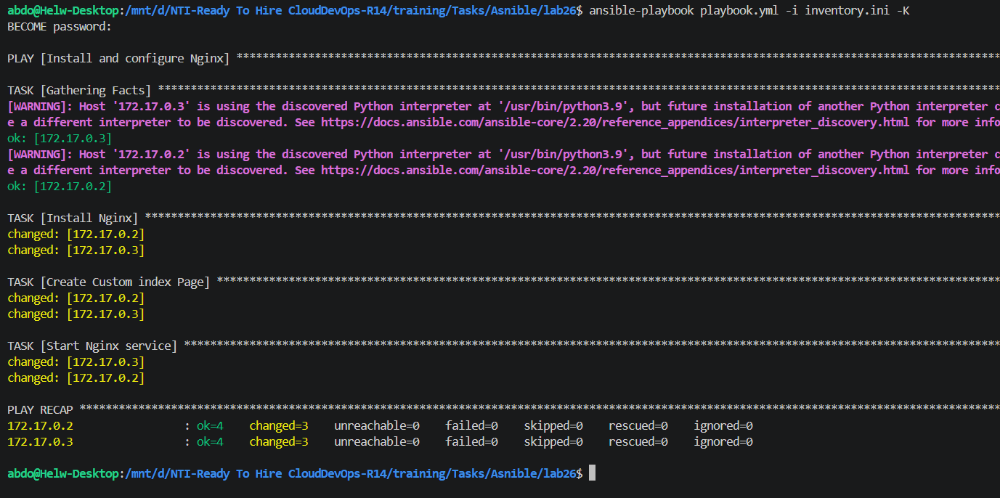
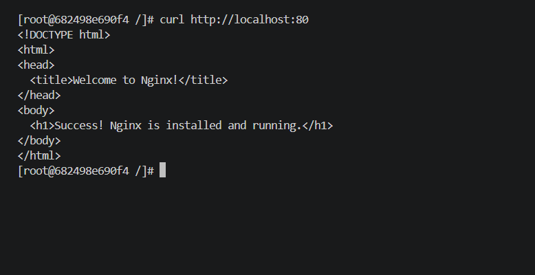

# Lab 27: Automated Web Server Configuration Using Ansible Playbooks

## 🎯 Lab Objectives
- Write an Ansible playbook to automate the configuration of a web server.
  - Install Nginx.
  - Customize the web page.
- Verify the configuration on managed node.

---

## 🚀 Lab Execution Steps

### Step 1: Write the Ansible Playbook
Created a `playbook.yml` file to automate the Nginx installation and configuration. Since the managed nodes are Rocky Linux containers, the `dnf` module was used instead of `apt`, and the service was started directly via the `command` module.


### Step 2: Execute the Playbook
Ran the playbook against the managed nodes defined in the `inventory.ini` file. The `-K` flag was used to prompt for the BECOME (sudo) password (`ansible123`) so Ansible can execute tasks with root privileges.

```bash
ansible-playbook playbook.yml -i inventory.ini -K
```

**Execution Output:**
As shown in the output, all tasks (Gathering Facts, Install Nginx, Create Custom index Page, Start Nginx service) were successfully executed with a `changed` status for both nodes.



### Step 3: Verify the Configuration on Managed Node
To ensure the web server is running and serving the custom HTML page correctly, accessed one of the managed containers interactively and performed a local HTTP request.

**1. Access the managed node:**
```bash
docker exec -it 68 bash
```


**2. Verify Nginx is serving the page:**
```bash
curl http://localhost:80
```

**Verification Output:**
The customized HTML page was successfully returned, confirming that Nginx was perfectly installed and configured by the Ansible Playbook.

