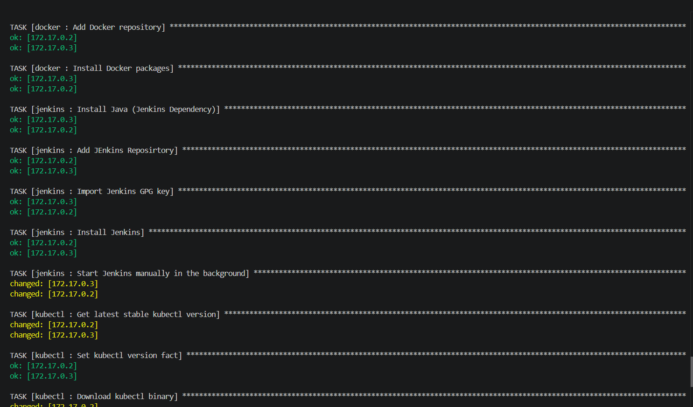
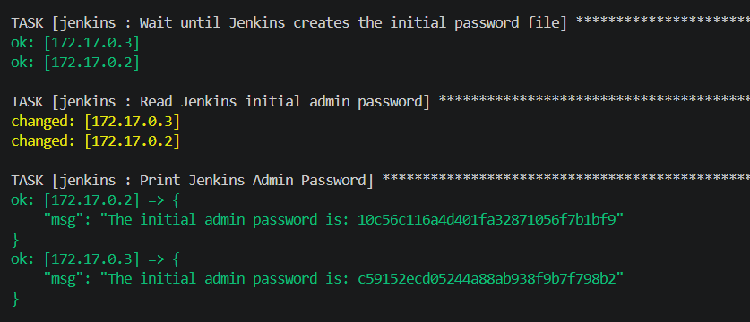

# Lab 28: Structured Configuration Management with Ansible Roles

## 🎯 Lab Objectives
- Create Ansible roles for configuring Docker, Kubernetes CLI (`kubectl`), and Jenkins.
- Write an Ansible playbook to run the created roles.
- Verify the installation on the managed nodes.

---

## 🛠️ Roles Configuration
The project is structured using Ansible Roles to modularize the configuration for each tool.

### 1. Docker Role
Adds the Docker repository and installs the required Docker packages (`docker-ce`, `docker-ce-cli`, `containerd.io`) using the `dnf` package manager.

### 2. Kubectl Role
Fetches the latest stable version of `kubectl` from Google's release servers, sets it as a variable dynamically, and downloads the binary directly to the system's execution path.

### 3. Jenkins Role
Ensures a clean installation of Java 21 (a Jenkins requirement), sets up the Jenkins repository, imports the GPG key, and installs Jenkins. It also includes custom tasks to start Jenkins manually in the background, wait for the initial admin password file to be generated, read it, and print it directly to the console.

---

## 🚀 Playbook Execution

A main `playbook.yml` was executed to run all the roles sequentially against the managed nodes defined in the inventory.

**Execution Command:**
```bash
ansible-playbook playbook.yml -i inventory.ini -K
```

**Execution Output:**
The playbook executes all roles successfully. As shown below, it resolves dependencies, installs the required tools across the managed nodes, and successfully retrieves and prints the Jenkins initial admin password for each node.




---

## ✅ Verification Steps

After a successful playbook execution, the following ad-hoc commands were used to verify the tools on the managed nodes:

**1. Verify Docker Installation:**
```bash
ansible managed_nodes -i inventory.ini -m command -a "docker --version"
```

**2. Verify Kubectl Installation:**
```bash
ansible managed_nodes -i inventory.ini -m command -a "kubectl version --client"
```

**3. Verify Jenkins Service is Running:**
```bash
ansible managed_nodes -i inventory.ini -m shell -a "curl -sI http://localhost:8080"
```
*Expected Result:* `HTTP/1.1 403 Forbidden` (Indicates the Jetty web server is running successfully and prompting for authentication).