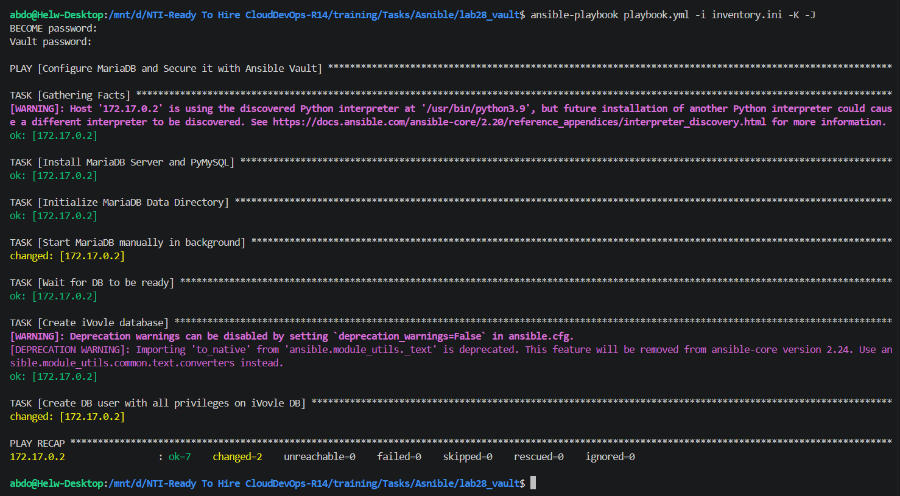
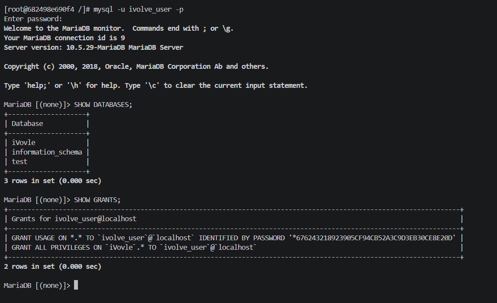

# Lab 29: Securing Sensitive Data with Ansible Vault

## 🎯 Lab Objectives
- Install MariaDB (Drop-in replacement for MySQL, optimized for our containerized environment).
- Create `iVovle` database.
- Create a user with ALL privileges on the `iVovle` database.
- Use **Ansible Vault** to encrypt sensitive information (Database User Password).
- Validate the DB on the managed node by connecting to it.

---

## 🔐 Step 1: Create Ansible Vault
Created an encrypted file (`secrets.yml`) using `ansible-vault` to store the database password securely, ensuring no plain-text credentials are exposed in the configuration or version control.

---

## 🛠️ Step 2: The Playbook Configuration
Created a playbook (`playbook.yml`) to automate the deployment. The playbook dynamically reads the encrypted password from the vault, installs MariaDB, initializes the database directory (to bypass Docker constraints), starts the service in the background, and seamlessly configures the database (`iVovle`) and user privileges.

---

## 🚀 Step 3: Playbook Execution
Ran the playbook, bypassing the host key checking for the dynamic container IP, and provided the vault password to decrypt the secrets on the fly. All tasks were executed successfully, including the database and user creation.

**Execution Output:**

---

## ✅ Step 4: Verification
Accessed the managed node directly and logged into the MariaDB monitor using the newly created user (`ivolve_user`) and the decrypted password. Executed SQL queries to verify that the database exists and that the user has the correct privileges (`ALL PRIVILEGES`).

**Verification Output:**
