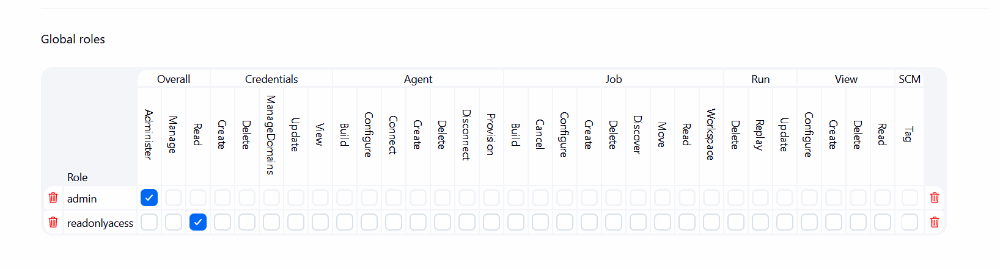
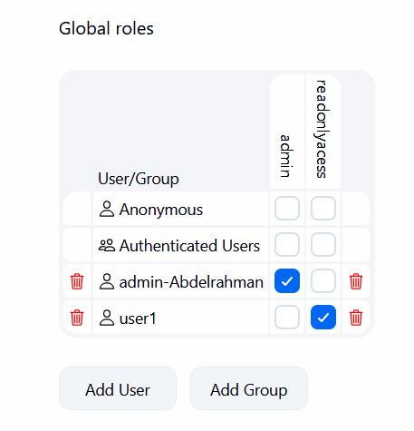
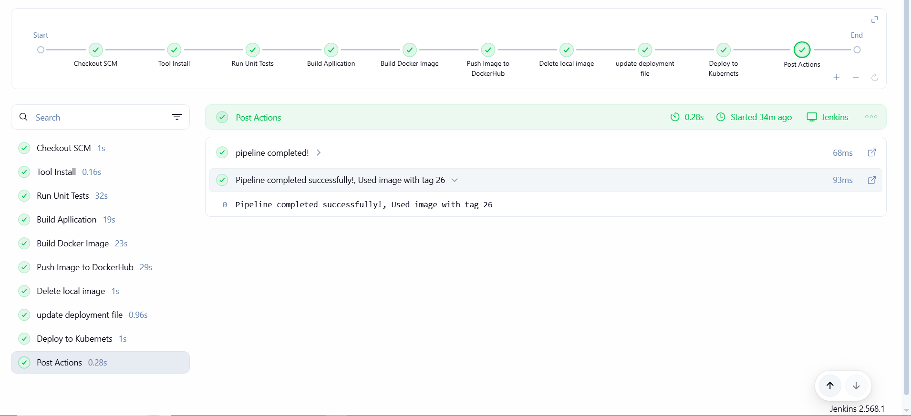
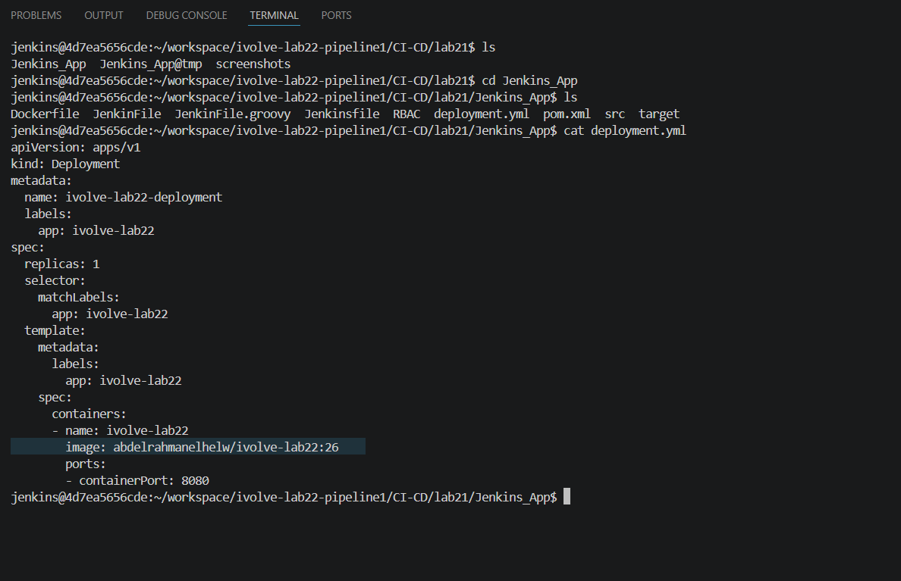
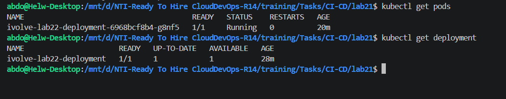

# Jenkins Labs: CI/CD Pipeline & Role-Based Authorization

This repository contains the documentation and execution evidence for completing Lab 21 and Lab 22 using Jenkins, Docker, and Kubernetes.

---

## Lab 21: Role-Based Authorization

### Objective
Configure Jenkins security by creating specific users and assigning them roles to control access and permissions.

### Execution
1. Created two global roles: `admin` (with full administrative privileges) and `readonlyacess` (with restricted read-only permissions).
2. Assigned the `admin` role to `admin-Abdelrahman` and the `readonlyacess` role to `user1`.

### Evidence
**1. Role Creation:**


**2. Role Assignment:**


---

## Lab 22: Jenkins Pipeline for Application Deployment

### Objective
Create a declarative CI/CD pipeline in Jenkins that automates the application build process, Docker image creation, and deployment to a Kubernetes cluster.

### Pipeline Stages
The pipeline automates the following steps:
1. **Run Unit Tests**: Executes `mvn test` to ensure code integrity.
2. **Build Application**: Packages the application using Maven.
3. **Build Docker Image**: Builds the container image from the cloned repository.
4. **Push Image to DockerHub**: Authenticates and pushes the dynamically tagged image to DockerHub.
5. **Delete Local Image**: Cleans up the local Docker environment by removing the built image.
6. **Update Deployment File**: Uses the `sed` command to dynamically update the image tag inside `deployment.yml`.
7. **Deploy to Kubernetes**: Applies the updated configuration to the local Minikube cluster using `kubectl apply`.
8. **Post Actions**: Configured to output specific messages based on the pipeline's status (`always`, `success`, and `failure`).

### Evidence
**Successful Pipeline Execution:**
The pipeline completed all stages successfully, utilizing image tag `26`.


---

## Verification & Deployment Checks

After the pipeline executed successfully, the following manual checks were performed inside the terminal to verify the deployment.

### 1. Verifying Deployment File Update
Ensured that the pipeline successfully updated the `deployment.yml` file with the correct, dynamically generated build tag (`abdelrahmanelhelw/ivolve-lab22:26`).

```bash
cat deployment.yml
```


### 2. Verifying Kubernetes Resources
Checked the status of the deployments and pods in the Kubernetes cluster to confirm that the new application container is active and running.

```bash
kubectl get pods
kubectl get deployment
```
