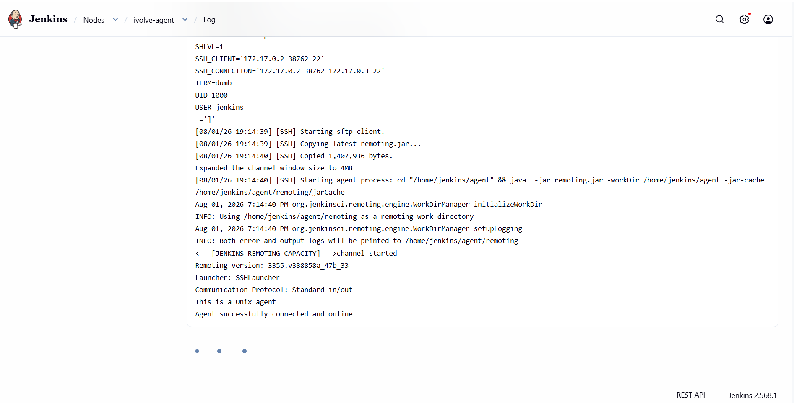
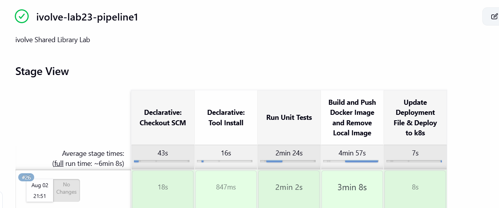

# Lab 23: CI/CD Pipeline Implementation with Jenkins Agents and Shared Libraries

## 📌 Overview
This project demonstrates a complete CI/CD pipeline using **Jenkins**, **Docker**, and **Kubernetes**. It involves setting up a Jenkins SSH Agent, utilizing Shared Libraries for pipeline stages, and deploying a containerized application to a local Minikube cluster.

## 🚀 Implementation Steps

### 1. Jenkins Agent Setup
We provisioned a Jenkins Agent using the official `jenkins/ssh-agent:jdk21` Docker image, attached it to the `minikube` network, and mounted the Docker socket to allow building images inside the agent. 

The agent was successfully connected to the Jenkins Master via SSH:

### 2. Required Tools Installation
The agent container was customized to include:
*   **Docker CLI**: Mounted directly from the host.
*   **Curl & Kubectl**: Installed manually via execution commands to allow the agent to interact with the Kubernetes cluster.

### 3. Shared Library Implementation
To keep our `Jenkinsfile` clean, maintainable, and to follow the DRY (Don't Repeat Yourself) principle, we encapsulated the core pipeline logic into a Jenkins **Shared Library**. 

Our custom library includes the following functions (Groovy scripts):
*   **`buildJavaApp`**: Handles the compilation, testing, and packaging of the Java application (e.g., executing Maven lifecycle phases).
*   **`buildandPushImage`**: Takes the built artifact, builds a new Docker image, and securely pushes it to the configured container registry.
*   **`deployTokenK8s`**: Connects to the Kubernetes cluster using the generated Service Account token and updates the deployment manifest to roll out the newly built image version.

### 4. Pipeline Execution
Using the custom functions from our Shared Library, the pipeline successfully executes the complete CI/CD lifecycle seamlessly:
1.  Checkout SCM
2.  Tool Install
3.  Run Unit Tests
4.  Build and Push Docker Image
5.  Update Deployment File & Deploy to k8s

