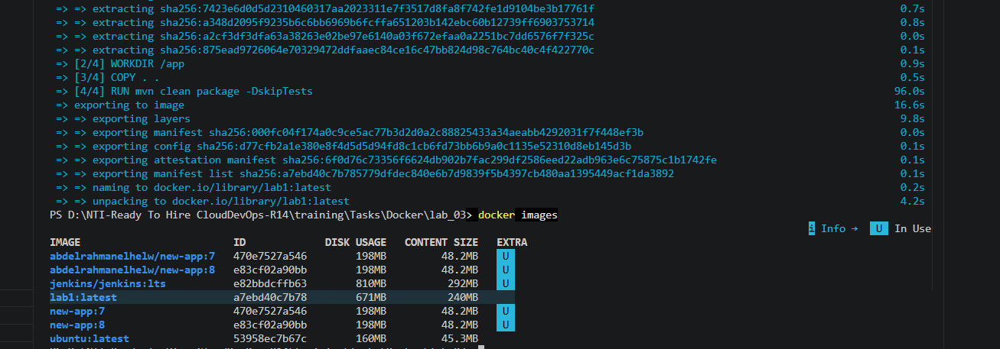
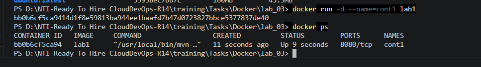
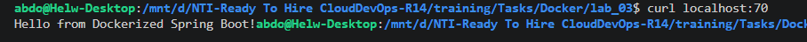
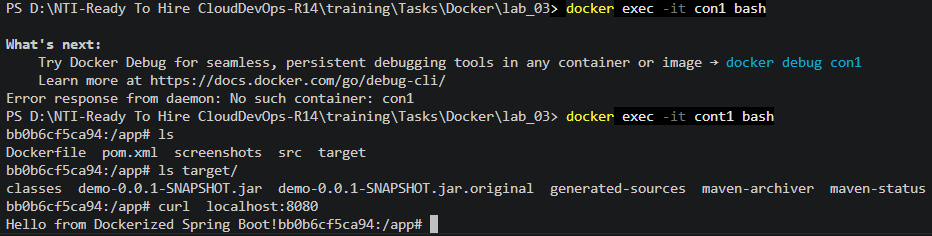

# 🐳 Containerizing a Java Spring Boot Application with Docker

This project demonstrates how to containerize a Java 17 Spring Boot application using **Docker**. It implements critical DevOps and cloud engineering best practices, including **Docker Layer Caching** for rapid builds and **Non-Root User Security** to ensure the container runs safely in production environments.

---

## 🏗️ Architecture & Best Practices Implemented

* **Alpine Linux Base (`eclipse-temurin-17-alpine`):** Uses a lightweight Linux distribution to reduce the overall attack surface and image size.
* **Docker Layer Caching:** Copies `pom.xml` and runs `mvn dependency:go-offline` *before* copying the source code. This ensures external dependencies are cached in a dedicated Docker layer, preventing re-downloads when only application code changes.
* **Principle of Least Privilege (Non-Root User):** Creates a dedicated `appuser` and assigns explicit ownership (`chown`) to prevent the application from running with root privileges inside the container.

---

## Step 1: Verify Local Application Build

Before containerizing, verify that the Java application compiles and builds successfully using local build tools:

```bash
mvn clean package
```


---

## Step 2: The Optimized Single-Stage Dockerfile

Create a `Dockerfile` in the project root with the following configuration:

```dockerfile
# 1. Use Maven base image with Java 17 (Alpine version for smaller footprint)
FROM maven:3.9-eclipse-temurin-17-alpine

# 2. Create a non-root user for security compliance
RUN adduser -D appuser

# 3. Create work directory inside the container
WORKDIR /app

# 4. Cache dependencies (Docker Layer Caching Best Practice)
COPY pom.xml .
RUN mvn dependency:go-offline

# 5. Copy source code and build the application
COPY src ./src
RUN mvn clean package -DskipTests

# 6. Grant non-root user ownership of the working directory
RUN chown -R appuser:appuser /app

# 7. Switch to non-root user execution
USER appuser

# 8. Expose application port
EXPOSE 8080

# 9. Define startup command
CMD ["java", "-jar", "target/demo-0.0.1-SNAPSHOT.jar"]
```

---

## Step 3: Build the Docker Image & Inspect Size

Execute the Docker build command to tag the image as `lab1`. Notice how Docker executes the layers sequentially, caching dependencies:

```bash
# Build the Docker image
docker build -t lab1 .

# Inspect generated images and note the disk usage size
docker images
```



> **💡 Note on Image Size:** The resulting image is **671MB** because it includes the full Maven build toolkit and downloaded repositories. While acceptable for development environments, production deployments typically utilize **Multi-Stage Builds** to strip away build tools and shrink the runtime artifact.

---

## Step 4: Launch the Container & Map Ports

Run the container in detached mode (`-d`) and map host port `70` to the container's exposed port `8080`. Verify the container is running and healthy:

```bash
# Run container in detached mode with port mapping
docker run -d -p 70:8080 --name=cont1 lab1

# Check active running containers
docker ps

Note: the output image if before port mapping 
```



---

## Step 5: External Verification (Host to Container)

Test the port forwarding by sending an HTTP request from your local machine to host port `70`:

```bash
curl localhost:70
```



* **Result:** The server successfully responds with `Hello from Dockerized Spring Boot!`, confirming traffic is routing cleanly from host port `70` into container port `8080`.

---

## Step 6: Container Introspection & Debugging (`exec`)

To inspect the internal file system and verify that the JAR file compiled correctly inside the container, open an interactive bash shell:

```bash
# Access container interactive terminal
docker exec -it cont1 bash

# Inspect workspace root and target artifacts
ls
ls target/

# Test internal loopback communication directly inside the container
curl localhost:8080
```



* **Verification:** The terminal confirms the presence of `demo-0.0.1-SNAPSHOT.jar` inside the `/app/target/` directory, and internal HTTP requests resolve successfully.

---

## Step 7: Lifecycle Cleanup

Once verification is complete, gracefully stop and remove the container from your environment:

```bash
# Stop running container
docker stop cont1

# Remove container instance
docker rm cont1
```
