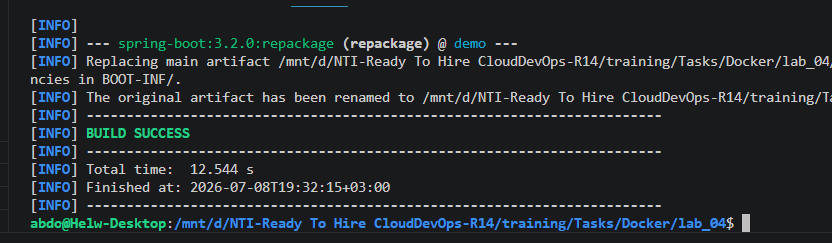
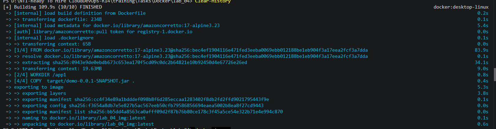
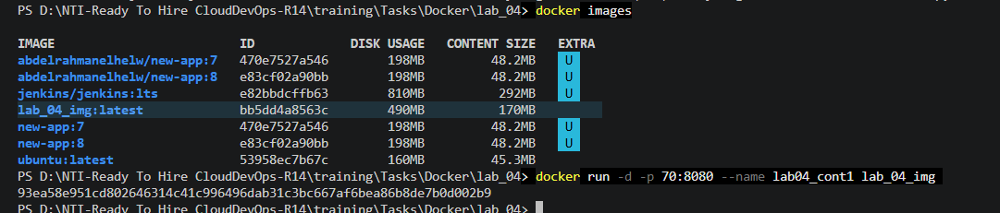
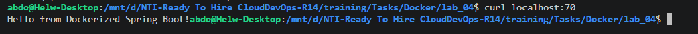
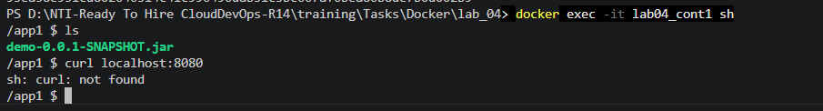

# 🐳 Optimizing Java Docker Images with Pre-Compiled Artifacts (Lab 04)

This project demonstrates an advanced DevOps pattern: **decoupling the build phase from the runtime environment**. Instead of compiling the Java application inside Docker (which bloats the image with build tools like Maven), we compile the artifact on the host machine first and inject the pre-built `.jar` into a lightweight **Amazon Corretto Alpine** runtime container.

---

## 🏗️ Architecture & Best Practices Implemented

* **Pre-Compiled Artifact Injection:** Compiles the application on the build host (`mvn clean package`) and copies only the distributable artifact into the runtime container, eliminating build dependency bloat.
* **Minimal Runtime Image (`amazoncorretto:17-alpine3.23`):** Uses an optimized, production-grade Java Runtime Environment (JRE) on Alpine Linux to minimize disk footprint and reduce security vulnerabilities.
* **Non-Root Security Compliance:** Creates a dedicated non-root user (`appuser`) to execute the Java application safely, adhering to the principle of least privilege.
* **Reduced Attack Surface:** Because the base image is a pure runtime environment, unnecessary utilities (like `bash` or `curl`) are stripped away by default.

---

## Step 1: Build the Application Locally

Before building the Docker image, compile the source code and generate the executable Java Archive (`.jar`) using your local Maven build tools:

```bash
mvn clean package
```



* **Result:** Maven compiles the source code and creates `demo-0.0.1-SNAPSHOT.jar` inside the local `target/` directory.

---

## Step 2: Configure the Lightweight Runtime Dockerfile

Create a `Dockerfile` in the root directory configured exclusively for runtime execution:

```dockerfile
# 1. Use a minimal Amazon Corretto Java 17 runtime on Alpine Linux
FROM amazoncorretto:17-alpine3.23

# 2. Set the working directory inside the container
WORKDIR /app1

# 3. Create a non-root user for security compliance
RUN adduser -D appuser

# 4. Switch to the non-root user
USER appuser

# 5. Copy the pre-built JAR artifact from the host target directory
COPY target/demo-0.0.1-SNAPSHOT.jar .

# 6. Expose the application traffic port
EXPOSE 8080

# 7. Define the startup execution command
CMD ["java", "-jar", "demo-0.0.1-SNAPSHOT.jar"]
```


---

## Step 3: Build the Runtime Image & Verify Optimization

Build the Docker image and tag it as `lab_04_img`. Notice how quickly the build executes because it does not need to download Maven dependencies or compile code:

```bash
# Build the optimized runtime image
docker build -t lab_04_img .
```



Verify the newly generated image and compare its disk usage size:

```bash
# List local Docker images
docker images
```



> **💡 Optimization Analysis:** Notice that `lab_04_img` is only **490MB**, significantly smaller than the **671MB** image from Lab 3. By removing Maven from the base image, we eliminated over 180MB of unnecessary build tools!

---

## Step 4: Deploy and Run the Container

Launch the container in detached mode (`-d`), mapping host port `70` to container port `8080`:

```bash
# Run the container with port forwarding
docker run -d -p 70:8080 --name lab04_cont1 lab_04_img

# Verify container running status
docker ps
```

---

## Step 5: Verify Application Accessibility from Host

Test the port mapping by sending an HTTP request from your local host machine to port `70`:

```bash
curl localhost:70
```



* **Result:** The application responds successfully with `Hello from Dockerized Spring Boot!`, confirming traffic routes correctly into the non-root runtime container.

---

## Step 6: Container Introspection (`exec`) & Security Validation

Open an interactive shell inside the running container to inspect the working directory. Note that because Alpine Linux is used, we must invoke `sh` instead of `bash`:

```bash
# Access the container filesystem using standard shell
docker exec -it lab04_cont1 sh

# Verify the JAR artifact is present in the workspace
ls
```



> **🛡️ Security Pro-Tip (`curl: not found`):** Notice what happened when attempting to run `curl localhost:8080` *inside* the container terminal: the shell returned `sh: curl: not found`. **This is not a bug; it is a security feature!** Pure runtime images like Amazon Corretto Alpine intentionally exclude networking utilities like `curl` or `wget` so that if an attacker ever breaches the application, they cannot easily download malicious scripts from the internet.

---

## Step 7: Lifecycle Cleanup

Once verification and testing are complete, gracefully stop and remove the container instance:

```bash
# Stop the running container
docker stop lab04_cont1

# Remove the container from the environment
docker rm lab04_cont1
```
