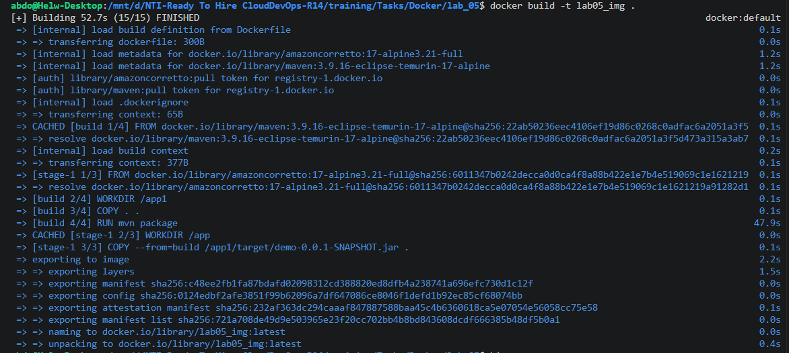
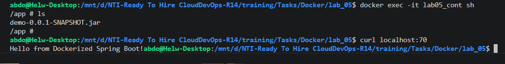

# 🐳 Advanced Docker Optimization: Multi-Stage Builds (Lab 05)

This project demonstrates the industry-standard DevOps pattern for containerizing compiled Java applications: **Multi-Stage Builds**. 

By utilizing multiple `FROM` statements within a single Dockerfile, we automate the entire Maven build and dependency resolution process inside a temporary container, but only package the final compiled `.jar` artifact into a lightweight runtime image. This eliminates the need for developers to install Maven locally while keeping the production image secure, minimal, and free of source code and build tools.

---

## 🏗️ Architecture & Best Practices Implemented

* **Stage 1 (The Builder):** Uses `maven:3.9.16-eclipse-temurin-17-alpine` to compile the application and generate the target artifact inside isolated container layers.
* **Stage 2 (The Runtime):** Uses `amazoncorretto:17-alpine3.21-full` as a bare-minimum Java 17 runtime environment. It copies *only* the compiled JAR file from Stage 1 (`--from=build`), leaving behind the Maven SDK, source code, and cached package repositories.
* **Zero Local Dependencies:** The application builds reliably on any environment with Docker installed, guaranteeing 100% build consistency across different CI/CD pipelines and developer machines.

---

## Step 1: Configure the Multi-Stage Dockerfile

Create or edit your `Dockerfile` using your preferred terminal editor:

```bash
vim Dockerfile
```

Paste the following multi-stage configuration:

```dockerfile
# === STAGE 1: Build the Application ===
FROM maven:3.9.16-eclipse-temurin-17-alpine AS build
WORKDIR /app1
# Copy source code and package the artifact
COPY . .
RUN mvn package

# === STAGE 2: Lightweight Runtime ===
FROM amazoncorretto:17-alpine3.21-full
WORKDIR /app
# Extract ONLY the compiled .jar from the "build" stage above
COPY --from=build /app1/target/demo-0.0.1-SNAPSHOT.jar .

# Define startup command and expose application port
CMD ["java", "-jar", "demo-0.0.1-SNAPSHOT.jar"]
EXPOSE 8080
```


---

## Step 2: Execute the Multi-Stage Build

Run the standard Docker build command to compile the code and generate the final image tagged as `lab05_img`:

```bash
docker build -t lab05_img .
```



> **💡 Build Layer Analysis:** Notice in the build output how Docker sequentially processes `[build 1/4]` through `[build 4/4]` to run `mvn package`, and then immediately switches to `[stage-1 1/3]` to build the runtime image. Once the artifact is copied over, the entire heavy Maven build container is discarded from the final image!

---

## Step 3: Deploy the Container with Port Forwarding

Launch the runtime container in detached mode (`-d`), mapping host port `70` to the container's exposed port `8080`:

```bash
docker run --name lab05_cont -d -p 70:8080 lab05_img
```

---

## Step 4: Verify Application & Inspect Runtime Environment

Test external HTTP traffic from the host machine, and then open an interactive shell inside the container to prove that the runtime environment is completely clean and only contains the executable `.jar` file.

```bash
# 1. Test application response from the local host
curl localhost:70

# 2. Access the container filesystem using standard shell
docker exec -it lab05_cont sh

# 3. List workspace directory contents
ls
```



* **Verification Results:** * The `curl` command successfully returns `Hello from Dockerized Spring Boot!`, confirming port `70` is correctly routing traffic to container port `8080`.
  * Running `ls` inside `/app` displays *only* `demo-0.0.1-SNAPSHOT.jar`. No source files, no `pom.xml`, and no build directories exist in the final container!

---

## Step 5: Lifecycle Cleanup

Once testing and verification are complete, stop and remove the container instance to keep your local Docker environment clean:

```bash
# Stop the running container
docker stop lab05_cont

# Remove the container instance
docker rm lab05_cont
```
