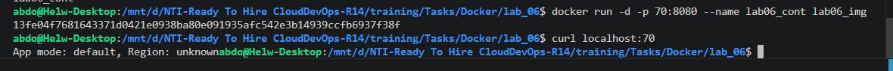
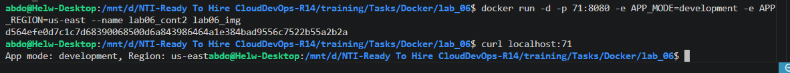
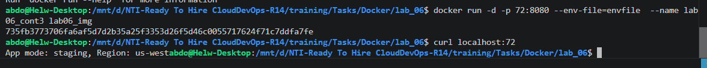
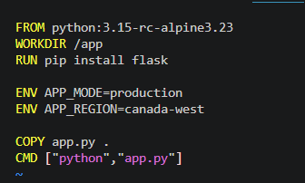
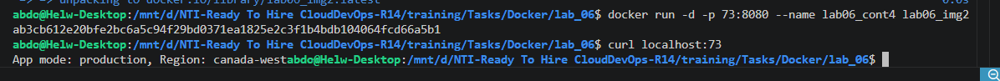

# 🐳 Managing Environment Variables in Docker (Lab 06)

This project demonstrates the three primary DevOps methodologies for configuring and injecting **Environment Variables** into a containerized application. Using a Python Flask microservice running on lightweight Alpine Linux, we explore how application behavior can be dynamically altered across different deployment environments (Development, Staging, and Production) without modifying or rebuilding the underlying application source code.

---

## 🏗️ Architecture & Core Concepts

* **Dynamic Configuration:** Decouples configuration from code. The Python application (`app.py`) reads `APP_MODE` and `APP_REGION` at runtime; if no variables are provided, it falls back to internal default values.
* **Method 1 (CLI Injection):** Using the `-e` flag during `docker run` for quick testing and overrides.
* **Method 2 (Env Files):** Using `--env-file` to load multiple configurations cleanly from a centralized file (ideal for complex multi-variable deployments).
* **Method 3 (Dockerfile Defaults):** Using the `ENV` instruction inside the Dockerfile to bake default fallback values directly into the image layers.

---

## Step 1: Baseline Setup (Dockerfile Version 1 & Default Execution)

Create the initial `Dockerfile` without any hardcoded environment variables. This allows us to observe how the application behaves when no configuration is passed:

```dockerfile
FROM python:3.15-rc-alpine3.23
WORKDIR /app
RUN pip install flask
COPY app.py .
CMD ["python", "app.py"]
```


Build the image as `lab06_img` and run the baseline container on port `70`:

```bash
# Build the baseline image
docker build -t lab06_img .

# Run the container without providing environment variables
docker run -d -p 70:8080 --name lab06_cont lab06_img

# Test the application response
curl localhost:70
```



* **Baseline Result:** The application responds with `App mode: default, Region: unknown`, confirming that the application gracefully utilizes its fallback values when no external variables are present.

---

## Step 2: Method 1 — Inline CLI Injection (`-e` Flag)

To dynamically set environment variables for ad-hoc testing or simple container deployments, pass the `-e` flag directly into the `docker run` command:

```bash
# Launch container with inline environment variables mapped to port 71
docker run -d -p 71:8080 -e APP_MODE=development -e APP_REGION=us-east --name lab06_cont2 lab06_img

# Verify variable injection
curl localhost:71
```



* **Method 1 Result:** The application outputs `App mode: development, Region: us-east`, successfully overriding the baseline defaults.

---

## Step 3: Method 2 — Centralized Configuration (`--env-file`)

When deploying applications with dozens of variables (e.g., database credentials, API keys), inline flags become unmanageable. The industry standard is to define variables in an external file (e.g., `envfile`) and pass it via `--env-file`:

```bash
# Create an environment file (example contents: APP_MODE=staging, APP_REGION=us-west)
# Launch container using the external configuration file mapped to port 72
docker run -d -p 72:8080 --env-file=envfile --name lab06_cont3 lab06_img

# Verify file-based variable injection
curl localhost:72
```



* **Method 2 Result:** The application reads the file contents and returns `App mode: staging, Region: us-west`.

---

## Step 4: Method 3 — Baked-In Image Defaults (Dockerfile Version 2)

If an application requires strict default operational parameters (such as defaulting to production settings unless explicitly overridden), use the `ENV` instruction inside the Dockerfile.

Modify your `Dockerfile` to include the default `ENV` instructions:

```dockerfile
FROM python:3.15-rc-alpine3.23
WORKDIR /app
RUN pip install flask

ENV APP_MODE=production
ENV APP_REGION=canada-west

COPY app.py .
CMD ["python", "app.py"]
```



Build this new configuration as a separate image (`lab06_img2`) and run it without any CLI overrides on port `73`:

```bash
# Build the secondary image containing default ENV instructions
docker build -t lab06_img2 .

# Run container without CLI variables to test baked-in defaults
docker run -d -p 73:8080 --name lab06_cont4 lab06_img2

# Verify baked-in values
curl localhost:73
```



* **Method 3 Result:** The container automatically initializes with `App mode: production, Region: canada-west` directly from the image layers!

---

## Step 5: Lifecycle Cleanup

Once all three configuration methodologies have been verified, stop and remove all active containers and test images to maintain a clean workspace:

```bash
# Stop all lab 06 containers
docker stop lab06_cont lab06_cont2 lab06_cont3 lab06_cont4

# Remove all lab 06 containers
docker rm lab06_cont lab06_cont2 lab06_cont3 lab06_cont4

# Optional: Remove test images
docker rmi lab06_img lab06_img2
```
