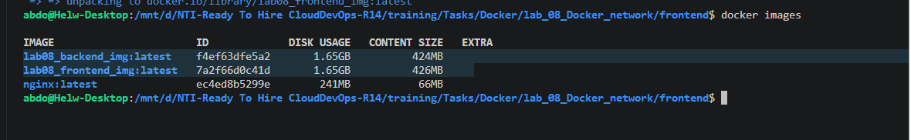
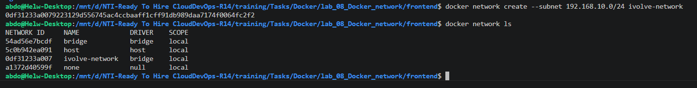
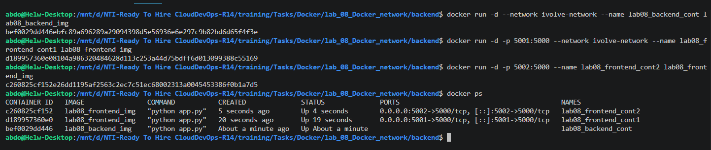

# 🐳 Docker Networking: Custom Microservices Architecture (lab08)

This project demonstrates how to configure **Custom Docker Networks** to securely connect multi-tier microservices (Frontend and Backend). 

By default, Docker places containers on a standard bridge network. However, best practice dictates creating isolated, custom bridge networks for applications. This lab proves that containers on the same custom network can seamlessly communicate, while containers left on the default network are securely isolated from the backend.

---

## 🏗️ Architecture & Core Concepts

* **Custom Bridge Network (`ivolve-network`):** A user-defined Docker network with a specific subnet (`192.168.10.0/24`) designed to isolate our application tier.
* **Backend Service:** A Python Flask API running securely on the custom network.
* **Frontend Service 1 (Integrated):** A Python web app connected to the custom network, successfully routing requests to the Backend.
* **Frontend Service 2 (Isolated):** A replica web app deliberately launched on Docker's default network to prove that it cannot communicate with the secured Backend.

---

## Step 1: Build the Microservice Images

Navigate to the respective directories and build the Docker images for both the frontend and backend applications based on their provided `Dockerfile` configurations.

```bash
# Build the backend image
cd backend/
docker build -t lab08_backend_img .

# Build the frontend image
cd ../frontend/
docker build -t lab08_frontend_img .

# Verify the images were successfully created
docker images
```



---

## Step 2: Create a Custom Docker Network

Create a dedicated, custom bridge network for the microservices to share, assigning it a specific IP subnet range.

```bash
# Create the custom network with a specific subnet
docker network create --subnet 192.168.10.0/24 ivolve-network

# Verify the network exists
docker network ls
```



---

## Step 3: Deploy and Network the Containers

Launch three containers to test network isolation. The Backend and Frontend 1 will share the custom network, while Frontend 2 will remain on the default bridge network.

```bash
# 1. Run Backend on the custom network
docker run -d --network ivolve-network --name lab08_backend_cont lab08_backend_img

# 2. Run Frontend 1 on the custom network (Mapped to port 5001)
docker run -d -p 5001:5000 --network ivolve-network --name lab08_frontend_cont1 lab08_frontend_img

# 3. Run Frontend 2 on the default network (Mapped to port 5002)
docker run -d -p 5002:5000 --name lab08_frontend_cont2 lab08_frontend_img

# Verify all three containers are up and running
docker ps
```



---

## Step 4: Network Introspection (IP Verification)

Inspect the internal IP addresses assigned to the containers to verify they have been correctly placed inside the `192.168.10.0/24` subnet.

```bash
# Check the IP address of Frontend 1
docker inspect lab08_frontend_cont1 | grep IPAddress

# Check the IP address of the Backend
docker inspect lab08_backend_cont | grep IPAddress
```


* **Introspection Result:** The containers on the custom network are successfully assigned IPs matching the defined subnet (e.g., `192.168.10.2` and `192.168.10.3`).

---

## Step 5: Verify Microservice Communication & Isolation

Test the application via the exposed host ports to prove that networking and isolation rules are actively enforced.

```bash
# Test Frontend 1 (On the custom network)
curl localhost:5001

# Test Frontend 2 (On the default network)
curl localhost:5002
```


* **Verification Results:**
  * `localhost:5001` returns `Frontend received: Hello from Backend!`. The internal DNS resolved perfectly across the custom network.
  * `localhost:5002` returns `Could not connect to backend`. Because Frontend 2 is on the default network, it is completely blind to the backend container, proving robust network security and isolation!

---

## Step 6: Lifecycle Cleanup

Gracefully dismantle the environment by stopping the containers, removing them, and tearing down the custom network.

```bash
# Stop all lab containers
docker stop lab08_frontend_cont1 lab08_frontend_cont2 lab08_backend_cont

# Remove all lab containers
docker rm lab08_frontend_cont1 lab08_frontend_cont2 lab08_backend_cont

# Delete the custom network
docker network rm ivolve-network
```