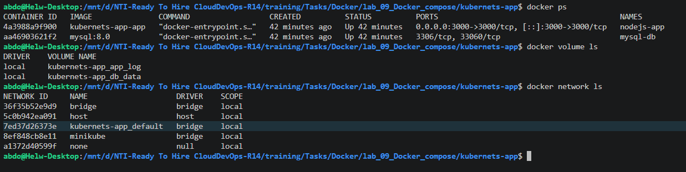
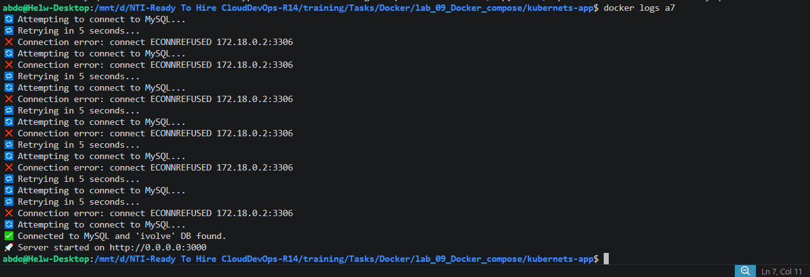
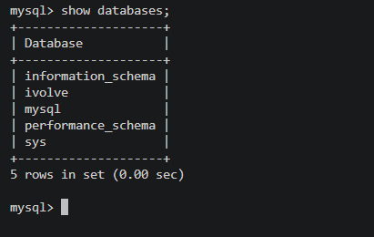
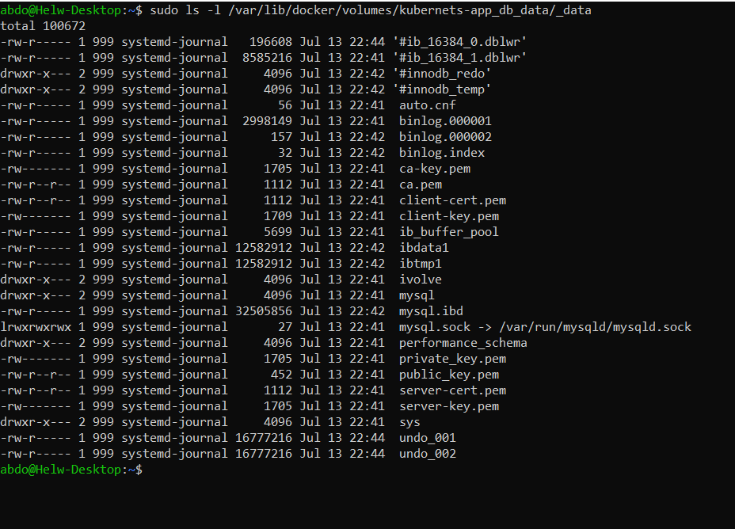
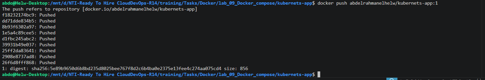

# 🐳 Containerized Node.js and MySQL Stack Using Docker Compose (Lab 09)

This project demonstrates how to orchestrate a multi-container application stack using **Docker Compose**. 

We deploy a custom Node.js application alongside a MySQL 8.0 database. Using infrastructure-as-code (`docker-compose.yaml`), we automate the networking, port mapping, environment variable injection, database initialization, and persistent volume creation in a single command.

---

## 🏗️ Architecture & Configuration

The stack consists of two integrated services:
1. **`app` (Node.js):** Builds dynamically from a local Dockerfile. It exposes port `3000` and depends on the database. It mounts a named volume (`app_log`) to persist application access logs.
2. **`db` (MySQL 8.0):** Pulls the official MySQL image, initializes a default database named `ivolve`, and mounts a named volume (`db_data`) to ensure database records survive container restarts.

---

## Step 1: Define the Docker Compose File

Create the `docker-compose.yaml` file in the root of the cloned application directory.

```yaml
services:
  app:
    build: .
    container_name: nodejs-app
    ports:
      - "3000:3000"
    environment:
      DB_HOST: mysql-db
      DB_USER: root
      DB_PASSWORD: root
    volumes:
      - app_log:/app/log
    depends_on:
      - db

  db:
    image: mysql:8.0
    container_name: mysql-db
    environment:
      MYSQL_ROOT_PASSWORD: root
      MYSQL_DATABASE: ivolve
    volumes:
      - db_data:/var/lib/mysql

volumes:
  db_data:
  app_log:
```


---

## Step 2: Spin Up the Stack

Use Docker Compose to build the custom Node.js image, pull the MySQL image, create the volumes/network, and launch the containers in detached mode:

```bash
# Build and start all services defined in the YAML file
docker compose up -d

# Verify containers, volumes, and networks were successfully created
docker ps
docker volume ls
docker network ls
```




---

## Step 3: Verify Application Logs & Database Initialization

Because the `app` container starts at the same time as `db`, the Node.js application is programmed to retry its connection until MySQL is fully ready. 

We can verify this resilience by checking the application logs, and then peering directly into the database container to ensure the `ivolve` database was created.

```bash
# 1. Check the Node.js application logs to confirm successful DB connection
docker logs nodejs-app
```


```bash
# 2. Access the MySQL container interactively to verify database creation
docker exec -it mysql-db bash

# (Inside the container) Log into MySQL and show databases:
mysql -u root -p
# Enter password: root
SHOW DATABASES;
# Type 'exit' to leave MySQL, then 'exit' again to leave the container.
```


```bash
# 3. Verify the physical persistent volume data on the host machine
sudo ls -l /var/lib/docker/volumes/kubernets-app_db_data/_data
```


---

## Step 4: Push the Custom Image to DockerHub

With the application successfully built and tested, tag the local Node.js image and push it to a remote DockerHub repository.

```bash
# Authenticate with DockerHub
docker login

# Tag the locally built image with your DockerHub username and version tag
docker tag kubernets-app-app abdelrahmanelhelw/kubernets-app:1

# Push the tagged image to the remote registry
docker push abdelrahmanelhelw/kubernets-app:1
```



---

## Step 5: Lifecycle Teardown

To cleanly tear down the entire stack—including the containers, default networks, and named volumes—use the `down` command with the `-v` flag.

```bash
# Stop and remove containers, networks, and volumes
docker compose down -v
```