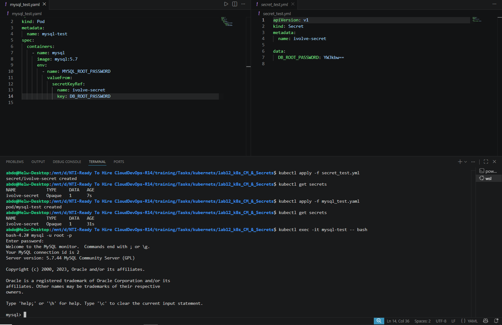
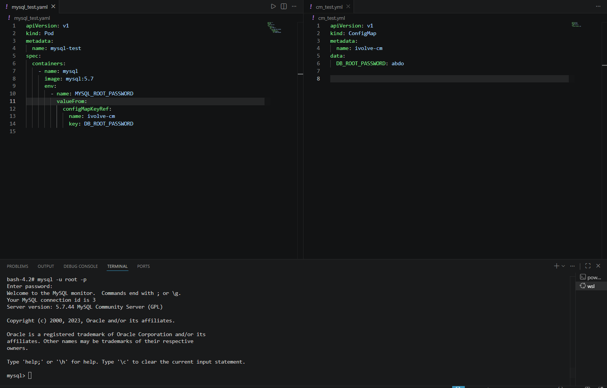

# 🔐 Managing Configuration and Sensitive Data with ConfigMaps and Secrets (Lab 12)

This project demonstrates how to decouple configuration artifacts and sensitive credentials from container images in Kubernetes. By using **ConfigMaps** for general settings and **Secrets** for confidential data, we maintain secure, reusable, and easily updatable deployment manifests.

---

## 🏗️ Architecture & Requirements

Based on the lab requirements, data is logically separated into two Kubernetes resources:
1. **ConfigMap:** Stores non-sensitive application variables (`DB_HOST`, `DB_USER`).
2. **Secret:** Stores sensitive credentials securely using Base64 encoding (`DB_PASSWORD`, `MYSQL_ROOT_PASSWORD`).

---

## Step 1: Creating the ConfigMap (Non-Sensitive Data)

We define a `ConfigMap` to hold the general database connection details. These are stored in plain text as they do not pose a security risk.

```yaml
# cm_test.yml (Example implementation)
apiVersion: v1
kind: ConfigMap
metadata:
  name: ivolve-cm
data:
  DB_HOST: "mysql-service"
  DB_USER: "app_user"
```

Apply the ConfigMap to the cluster:
```bash
kubectl apply -f cm_test.yml
```

---

## Step 2: Creating the Secret (Sensitive Data)

To protect the database passwords, we create a Kubernetes `Secret`. Before adding the values to the YAML file, they must be **Base64 encoded**.

*(For example, encoding the password 'abdo' results in `YWJkbw==`)*

```yaml
# secret_test.yml
apiVersion: v1
kind: Secret
metadata:
  name: ivolve-secret
type: Opaque
data:
  DB_ROOT_PASSWORD: YWJkbw==  # Base64 encoded password
```

Apply the Secret to the cluster and verify its creation:
```bash
kubectl apply -f secret_test.yml
kubectl get secrets
```

---

## Step 3: Deploying the Pod with Injected Variables

Next, we deploy a MySQL Pod and inject the data from both our ConfigMap and Secret directly into the container as Environment Variables. We use `configMapKeyRef` and `secretKeyRef` to map specific keys to the container's expected variables.

```yaml
# mysql_test.yaml
apiVersion: v1
kind: Pod
metadata:
  name: mysql-test
spec:
  containers:
    - name: mysql
      image: mysql:5.7
      env:
        # Injecting sensitive data from the Secret
        - name: MYSQL_ROOT_PASSWORD
          valueFrom:
            secretKeyRef:
              name: ivolve-secret
              key: DB_ROOT_PASSWORD
```

Apply the Pod configuration:
```bash
kubectl apply -f mysql_test.yaml
```



---

## Step 4: Verification & Testing

To prove that the ConfigMap and Secret successfully injected the variables into the running container, we execute an interactive bash shell inside the Pod and attempt to log into the MySQL database using the configured password.

```bash
# Exec into the running pod
kubectl exec -it mysql-test -- bash

# Inside the container, log into MySQL using the injected root password
mysql -u root -p
```

**Result:** Successful login to the MySQL monitor, confirming that the container securely received the `MYSQL_ROOT_PASSWORD` from the Kubernetes Secret!

