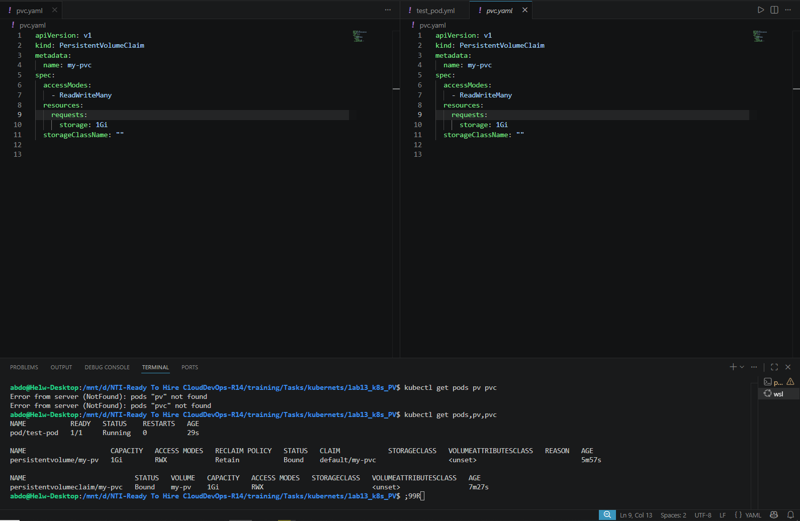

# 💾 Lab 13: Persistent Storage Setup for Application Logging

This project demonstrates how to set up **Static Provisioning** in Kubernetes using a Persistent Volume (PV) and a Persistent Volume Claim (PVC). It utilizes the `hostPath` storage type to provide a dedicated directory on the Node's filesystem for application logs, ensuring data persistence even if the pods are deleted.

---

## 🏗️ Lab Requirements

**1. Persistent Volume (PV):**
* **Capacity:** 1Gi
* **Storage Type:** hostPath
* **Path:** `/mnt/app-logs`
* **Access Mode:** ReadWriteMany (RWX)
* **Reclaim Policy:** Retain

**2. Persistent Volume Claim (PVC):**
* **Requested Storage:** 1Gi
* **Access Mode:** ReadWriteMany (Must match the PV)

---

## 📄 Kubernetes Manifests

### 1. The Persistent Volume (`pv.yaml`)
This manifest provisions the actual storage on the Node. We use `storageClassName: ""` to enforce Static Provisioning.

```yaml
apiVersion: v1
kind: PersistentVolume
metadata:
  name: my-pv
spec:
  capacity:
    storage: 1Gi
  accessModes:
    - ReadWriteMany
  persistentVolumeReclaimPolicy: Retain
  storageClassName: ""
  hostPath:
    path: /mnt/app-logs
    type: DirectoryOrCreate
```

### 2. The Persistent Volume Claim (`pvc.yaml`)
This manifest represents the application's request for storage. Because the capacity, access modes, and storage class match perfectly, Kubernetes directly binds this PVC to the PV above.

```yaml
apiVersion: v1
kind: PersistentVolumeClaim
metadata:
  name: my-pvc
spec:
  accessModes:
    - ReadWriteMany
  resources:
    requests:
      storage: 1Gi
  storageClassName: ""
```

---

## 🚀 Execution & Verification

Apply the manifests to your Kubernetes cluster:
```bash
kubectl apply -f pv.yaml
kubectl apply -f pvc.yaml
kubectl apply -f test_pod.yml
```

Verify that the PV and PVC are successfully **Bound**, and the Pod is **Running**:
```bash
kubectl get pods,pv,pvc
```

**Result:**
As shown in the output, the status for both the PV (`my-pv`) and PVC (`my-pvc`) successfully transitions to **Bound**. The Pod (`test-pod`) mounts the volume and enters the **Running** state.

