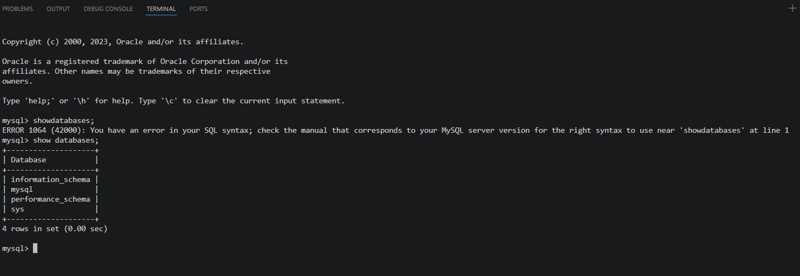

# Lab 14: StatefulSet with Headless Service

## 📝 Overview
This repository contains the deployment manifests and execution steps for deploying a MySQL database using a `StatefulSet` and a `Headless Service` in Kubernetes. The deployment ensures data persistence, secure password management, and strict pod scheduling.

## 🎯 Lab Objectives
* Create a StatefulSet with 1 replica running MySQL.
* Configure the StatefulSet pods to consume the root password from the secret.
* Add a toleration to the StatefulSet pod spec for the taint key node=worker with effect NoSchedule.
* Configure a Persistent Volume Claim (PVC) and mount it to /var/lib/mysql in the StatefulSet.
* Write a YAML manifest for a headless service (clusterIP: None) targeting the MySQL StatefulSet pods.
* Confirm the database is operational by connecting with a MySQL client.

---

## ⚙️ Node Configuration
Before deploying the resources, the target worker node must be tainted and labeled to enforce scheduling rules:

    kubectl taint node minikube-m02 node=worker:NoSchedule
    kubectl label node minikube-m02 node=worker

---

## 🚀 Deployment Steps
Apply the configuration files in the exact order below to provision the entire stack:

    kubectl apply -f ivolve_NameSpace.yml
    kubectl apply -f cm_test.yml 
    kubectl apply -f secret_test.yml 
    kubectl apply -f headless_svc.yml 
    kubectl apply -f statefulset.yml 

---

## ✅ Verification & Testing

### 1. Pod Status Check
Ensure the StatefulSet pod is up and running in the `ivolve` namespace:

    kubectl get pods -n ivolve

### 2. Database Connectivity Test
Drop into the pod's shell to execute database commands:

    kubectl exec -it -n ivolve ivolve-statefulset-0 -- sh

Once inside the shell, connect to the MySQL instance and list the initialized databases:

    mysql -u root -p<your_password>
    mysql> show databases;

### 🖼️ Expected Output:

