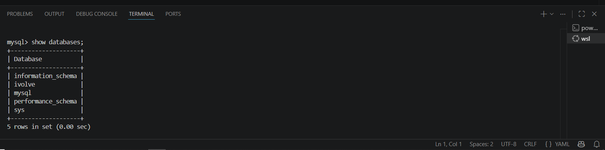
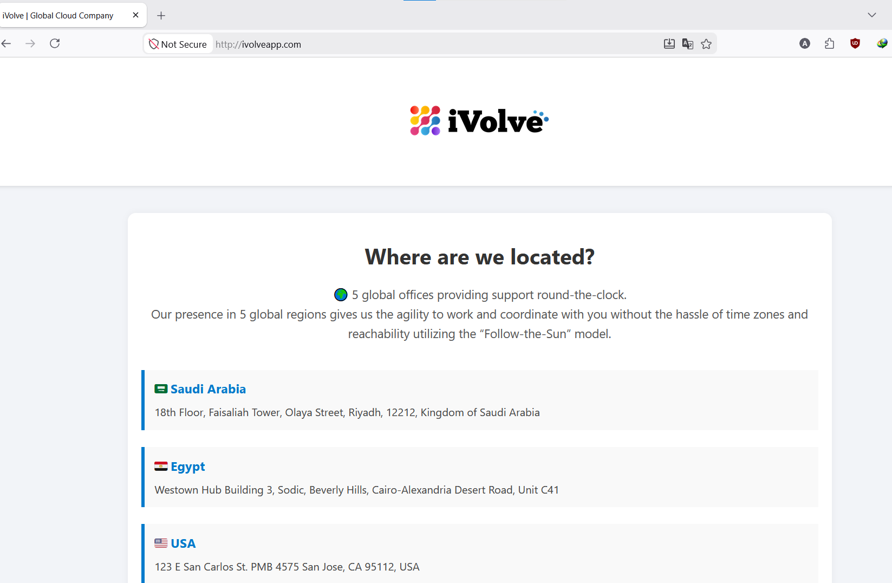

# Kubernetes Multi-Tier Deployment: Node.js App with Init Container & Ingress

## Project Overview
This repository contains the configuration and documentation for a robust, multi-tier containerized Kubernetes deployment. Developed as part of the NTI Cloud and DevOps accelerator program, this project demonstrates advanced Kubernetes orchestration techniques, including StatefulSets, Init Containers, Persistent Volumes, and Ingress routing within a local WSL/Ubuntu environment.

## Architecture & Requirements

### Lab 15: Node.js Application Deployment with ClusterIP Service
*   **Deployment Configuration:** Created a Deployment named `nodejs-app` with 2 replicas (maintaining 1 running pod).
*   **Image Management:** Utilized a custom Docker image pulled from Docker Hub.
*   **Environment Variables:** Configured pods to securely consume environment variables from pre-defined ConfigMaps and Secrets.
*   **Scheduling:** Added a toleration to the pod specification for the taint key `node=worker` with the effect `NoSchedule` to ensure proper node assignment.
*   **Storage:** Configured the application pods to utilize a statically created Persistent Volume (PV).
*   **Networking:** Created a ClusterIP service named `nodejs-service` to reliably balance internal traffic across the deployment replicas.

### Lab 16: Kubernetes Init Container for Pre-Deployment Database Setup
*   **Init Container Setup:** Modified the existing Node.js deployment to inject an initialization container before the primary application starts.
*   **Database Client Image:** Utilized the `mysql:5.7` image for the init container to execute database commands.
*   **Secure Connection:** Passed necessary database connection parameters (Host, User, Passwords) to the init container dynamically using ConfigMaps and Secrets.
*   **Automated Provisioning:** The init container automatically connects to the backend MySQL StatefulSet, creates the `ivolve` database, and grants the application user complete access privileges.
*   **Validation:** Successfully verified the existence of the `ivolve` database and user privileges by executing a manual MySQL client connection.

### Bonus: External Routing via NGINX Ingress Controller
Instead of relying strictly on port-forwarding, the application is exposed externally using an NGINX Ingress Controller. The traffic is routed securely from the host machine to the ClusterIP service through a designated local domain.

---

## Deployment Instructions

### Prerequisites
*   A running Kubernetes cluster (e.g., Minikube on WSL/Ubuntu).
*   `kubectl` CLI tool configured.
*   NGINX Ingress Addon enabled (`minikube addons enable ingress`).

### 1. Apply Infrastructure Configurations
Ensure your secrets, ConfigMaps, and Persistent Volumes are applied first:

    kubectl apply -f pv.yml
    kubectl apply -f pvc.yml
    kubectl apply -f cm.yml
    kubectl apply -f secret.yml

### 2. Deploy the Database (StatefulSet)
The backend MySQL database must be running to allow the init container to configure it.

    kubectl apply -f statefulset.yml
    kubectl apply -f headless-svc.yml

*Wait until the StatefulSet pod (`ivolve-statefulset-0`) is in the `Running` state.*

### 3. Deploy the Node.js Application
Deploy the frontend application. The init container will intercept the startup, securely connect to the MySQL database, create the necessary schemas, and terminate successfully before the Node.js container spins up.

    kubectl apply -f app-deploy.yml
    kubectl apply -f app-svc.yml

### 4. Configure Ingress Routing
Apply the Ingress manifest to create the routing rules for the application.

    kubectl apply -f ingress.yml

Map the application domain in your host machine's `hosts` file (`C:\Windows\System32\drivers\etc\hosts` or `/etc/hosts`):

    127.0.0.1 ivolveapp.com

If utilizing Minikube on Windows with a Docker driver, execute the tunnel command in a dedicated terminal to bridge the network:

    minikube tunnel

---

## System Verification

**1. Database Verification:**
Accessed the MySQL pod interactively to confirm that the `ivolve` database was successfully generated by the Init Container automated script. The database is visible and fully operational.

**2. Application & Ingress Verification:**
Navigated to `http://ivolveapp.com` in a local web browser. The Node.js application successfully loaded, confirming that the Ingress controller correctly resolved the domain, routed the traffic to the ClusterIP, and successfully served the application interface.

