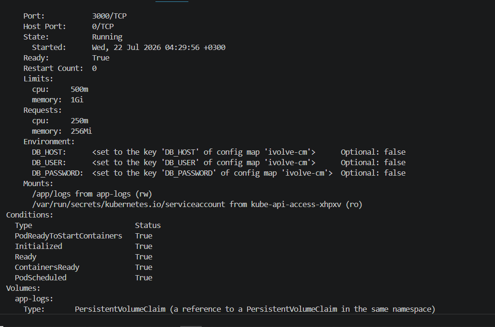
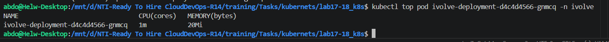
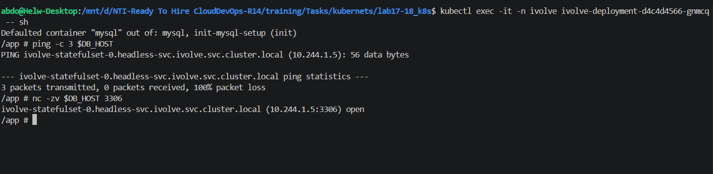

# Kubernetes Multi-Tier Deployment: Resource Limits & Network Security

## Project Overview
This repository contains the continuation of the Kubernetes multi-tier application deployment, developed as part of the NTI Cloud and DevOps accelerator program. Building upon the foundational StatefulSet and Ingress configurations, this phase focuses on optimizing cluster stability through Pod Resource Management and hardening internal infrastructure security using Kubernetes Network Policies.

## Architecture & Enhancements

### Lab 17: Pod Resource Management
To prevent resource starvation and ensure predictable application performance on the worker nodes, compute resources (CPU and Memory) were explicitly defined for the Node.js application pods.

*   **Resource Allocation Strategy:**
    *   **Requests:** Configured to guarantee the minimum required resources for the application to function (CPU: 250m, Memory: 256Mi).
    *   **Limits:** Configured to set a hard cap on resource consumption, preventing the pod from monopolizing node resources (CPU: 500m, Memory: 1Gi).
*   **Verification:** Applied limits and requests were successfully verified by inspecting the live pod specifications.
*   **Monitoring:** The Minikube Metrics Server was enabled and utilized to monitor the real-time compute utilization of the running application.

### Lab 18: Control Pod-to-Pod Traffic via Network Policy
A zero-trust networking approach was implemented to secure the backend database. A NetworkPolicy was applied to drop all default traffic and strictly control incoming connections to the MySQL StatefulSet.

*   **Policy Name:** `allow-app-to-mysql`
*   **Target:** Pods labeled with `app=mysql`.
*   **Ingress Rules:** 
    *   Restricted access exclusively to the MySQL default TCP port `3306`.
    *   **Bonus Implementation:** Advanced filtering was applied using both a `namespaceSelector` and a `podSelector` in the `from` block. This ensures that traffic is only accepted if it originates from the specific Node.js frontend pods residing within the validated `ivolve` namespace.

---

## Execution Commands

Based on the deployment history, the following sequence of commands was used to apply configurations and verify the environment:

### 1. Cluster Initialization & Application Deployment
    minikube start
    kubectl get nodes
    kubectl apply -f statefulset.yml
    kubectl apply -f app-deploy.yml

### 2. Network Policy Application
    kubectl apply -f networkpolicy.yml

### 3. Resource Management Verification (Lab 17)
Retrieve the pod name and inspect its specifications to confirm CPU and memory limits/requests are correctly injected:
    kubectl get pods -n ivolve
    kubectl describe pod ivolve-deployment-d4c4d4566-gnmcq -n ivolve

Enable the Minikube metrics server addon and monitor real-time resource consumption:
    minikube addons enable metrics-server
    kubectl top pod ivolve-deployment-d4c4d4566-gnmcq -n ivolve

### 4. Network Policy Verification (Lab 18)
Access the frontend pod's interactive shell to test internal cluster connectivity to the backend database:
    kubectl exec -it -n ivolve ivolve-deployment-d4c4d4566-gnmcq -- sh

*(Once inside the pod, `ping -c 3 $DB_HOST` is executed to verify ICMP packets are dropped, followed by `nc -zv $DB_HOST 3306` to verify authorized TCP connections are established).*

---

## System Verification

### 1. Resource Management Verification
The `kubectl describe pod` command confirmed the successful injection of resource constraints into the active pod specification.

Real-time telemetry was validated using `kubectl top pod`, confirming that the application is operating efficiently and well within its defined compute boundaries (consuming approximately 1m CPU and 20Mi Memory).

### 2. Network Policy Enforcement
To prove the NetworkPolicy is actively intercepting and filtering traffic, interactive network tests were executed from within the frontend application pod targeting the backend database service (`$DB_HOST`):

*   **ICMP Traffic Denied:** Executing a `ping` command resulted in 100% packet loss. This confirms that the policy successfully drops unauthorized protocols.
*   **TCP Traffic Allowed:** Executing `nc -zv` against port 3306 returned an `open` status, confirming that authorized application traffic is successfully routed and accepted by the MySQL instance.

