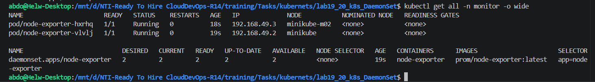
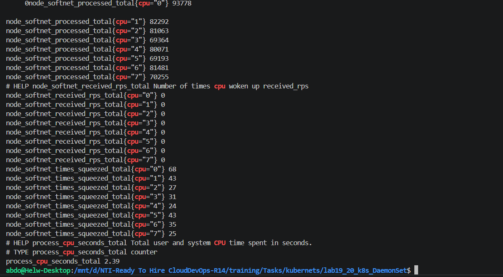
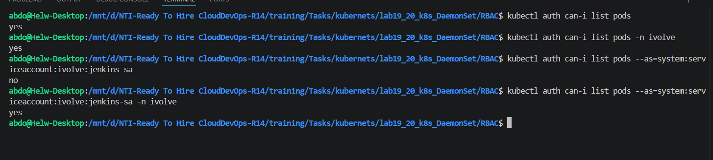

# Kubernetes Administration: DaemonSets, RBAC, and Monitoring

## Project Overview
This repository expands upon the previously established multi-tier Kubernetes deployment (which includes the Node.js frontend, MySQL StatefulSet, Ingress Controller, and Network Policies). The current phase (Labs 19 & 20) introduces cluster-wide hardware monitoring using DaemonSets and enforces the principle of least privilege using Role-Based Access Control (RBAC).

## New Files Introduced
The following files were added to the existing infrastructure to implement the monitoring and security requirements:

*   **`monitor_NameSpace.yml`**: Provisions the isolated `monitor` namespace.
*   **`daemonSet.yaml`**: Deploys the Prometheus `node-exporter` as a DaemonSet.
*   **`RBAC/sa.yml`**: Defines the `jenkins-sa` ServiceAccount.
*   **`RBAC/role.yml`**: Defines the restricted `pod-reader` Role.
*   **`RBAC/rolebinding.yml`**: Binds the `pod-reader` Role to the `jenkins-sa` ServiceAccount.

---

## Lab 19: Node-Wide Pod Management with DaemonSet

### Architecture
To ensure comprehensive infrastructure monitoring, a Prometheus `node-exporter` was deployed globally. A `DaemonSet` guarantees that exactly one exporter pod runs on every active node in the cluster. Tolerations (`operator: "Exists"`) were applied to bypass all existing taints, allowing the exporter to successfully schedule on master/control-plane nodes as well.

### Execution Commands

    # Create the monitoring namespace
    kubectl apply -f monitor_NameSpace.yml

    # Deploy the node-exporter DaemonSet
    kubectl apply -f daemonSet.yaml

    # Verify the pods are running on all nodes
    kubectl get all -n monitor -o wide

### Verification
The DaemonSet successfully scheduled the `node-exporter` pods across the cluster nodes:

Metrics were successfully retrieved from the host network via port `9100`:

    curl http://192.168.49.2:9100/metrics | grep -i cpu

---

## Lab 20: Securing Kubernetes with RBAC and Service Accounts

### Architecture
To secure automated API interactions (such as a CI/CD pipeline accessing the cluster), a dedicated Service Account (`jenkins-sa`) was provisioned in the `ivolve` namespace. Instead of utilizing default broad permissions, a highly restricted Role (`pod-reader`) was created and bound to this account, strictly limiting its capabilities to `get` and `list` operations on Pods.

### Execution Commands

    # Navigate to the RBAC directory
    cd RBAC/

    # Apply the Service Account, Role, and RoleBinding
    kubectl apply -f sa.yml
    kubectl apply -f role.yml
    kubectl apply -f rolebinding.yml

    # Generate a 24-hour authentication token for the jenkins-sa Service Account
    kubectl create token --duration=24h jenkins-sa -n ivolve

### Verification
To validate the RBAC enforcement, `kubectl auth can-i` was used to impersonate the `jenkins-sa` ServiceAccount. The tests successfully confirmed that the account has permission to list pods within the `ivolve` namespace, but is correctly denied from listing pods globally or outside its granted scope:

    # Verify permissions as the jenkins-sa ServiceAccount
    kubectl auth can-i list pods --as=system:serviceaccount:ivolve:jenkins-sa -n ivolve

